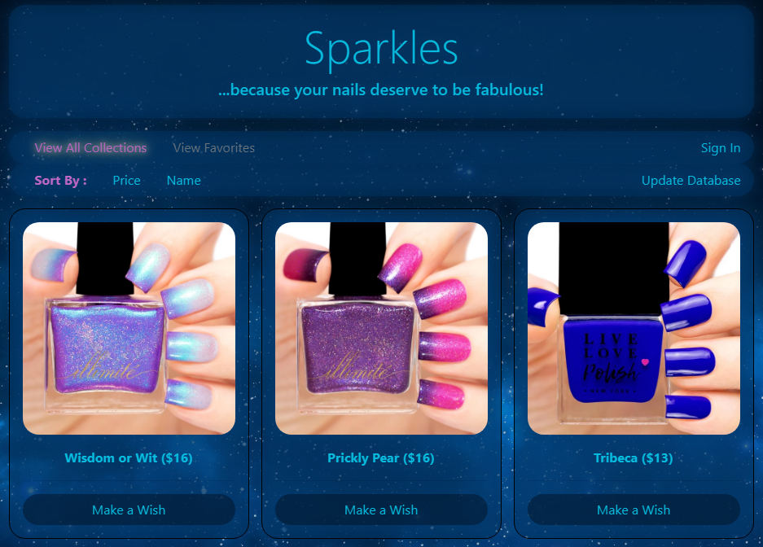

# Sparkles ...because your nails deserve to be fabulous!

**`Technologies Used:`** MongoDB, Handlebars, Axios, BCrypt, Cheerio, Heroku, Node.js, Express.js, Bootstrap, jQuery, Javascript

## `Summary`
A site that scraps data from two different sites for new & best selling nail polishes. Features user auth, saving favorites, and commenting on products.

## `Highlights:`
- Deployed to Heroku
- Node.js
- Express.js
- MongoDB
- Handlebars
- Hashed Passwords
- Fabulous Animations

## `Dependencies`
- axios
- bcrypt
- cheerio
- express 
- express-handlebars
- mongoose
- morgan

## `Goals`
- Find a better way to update database for price changes.

## `Known Issues`
- Due to the sites lacking UID for their products in the document body, a new polish will be created if the product name changes. (Unlikely, but possible)


## `Learning Experience`
- Learned scrape data from other sites
- Learned to use MongoDB
- Learned some neat tricks to deal with relative path issues (Frontend)

## `Screenshots`


## `Code Snippets`
``Scraping data from a site to push into DB``
```
function scrapeEmilyDeMolly(root, path, cb) {
    var url = root + path;
    axios.get(url).then(function (response) {

        // Load the HTML into cheerio and save it to a variable
        var $ = cheerio.load(response.data);

        // An empty array to save the data that we'll scrape
        var polishes = [];

        // get them alllllllllllll
        $("div.product-grid").children("div.grid-item").each(function (i, element) {
            var name = $(element).children().children("p").children("span").text().trim();
            var price = $(element).children().children("p").text().trim();
            // trim the price from the nasty string
            price = price.slice(price.length - 7, price.length);
            price = price.replace(/ +/g, "");
            price = price.replace(/\n/g, "");
            price = price.replace("$", "");
            var link = $(element).children("a").attr("href");
            var img = $(element).find("div.product-grid-image").children().children("img").attr("src");
            // push result into polishes as an object
            var polish = {
                name: name,
                price: parseFloat(price).toFixed(2),
                link: root + link,
                img: img
            };

            // attempt to find then update/create
            db.Polish.findOneAndUpdate({ name: polish.name }, { $set: polish }, { new: true })
                .then(function (data) {
                    if (data) {
                        // update information
                        console.log("polish updated")
                    } else {
                        // create new polish
                        db.Polish.create(polish);
                        console.log("new polish added");
                    }
                })

            // push polish into polishes array for response data
            polishes.push(polish);
        });

        // return callback
        return cb(polishes);
    });
}
```
``Hashing passwords before pushing into DB``
```
// hash that password
bcrypt.hash(req.body.password, 10, function (err, hash) {
    // then create user with password set to hash
    db.User.create({
        username: req.body.username,
        password: hash
    }, function (err, data) {
        if (err) {
            console.log(err)
        } else {
            res.json(data);
        }
    })
})
```
## `Links`
LinkedIn: https://www.linkedin.com/in/kerwinhy/<br>
GitHub: https://github.com/seiretsym<br>

## `Deployed Site:`
Heroku: https://manisparkles.herokuapp.com/
